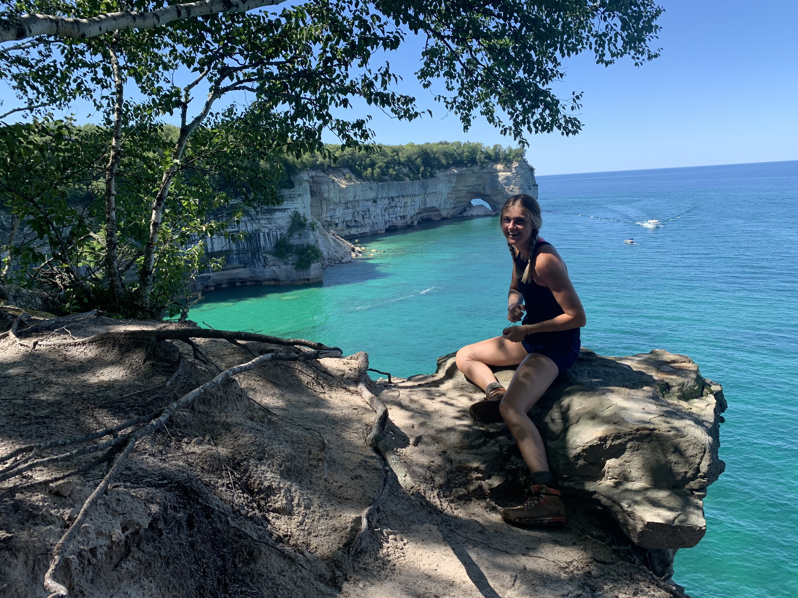

# Welcome to WanderList!

Learn more about the creator of WanderList: www.linkedin.com/in/melissa-rice22

<h2>The What</h2>
WanderList is a fullstack web application that allows users to search for all the National Parks in the US by state, and then add them to their "Favorites" page. To start, a user must create an account and login using an email and password. Once the user is logged in, they will be asked to pick a state of interest using the states postal code (ex. Michigan Postal Code is MI). Once they click submit, they will be taken to a page that lists all of the National Parks in that state along with their description, the directions, and the state postal code the park resides in. A user can then read through the list and add a park to their favorites by clicking the heart button. Once they head over to the favorites page, they can choose to change the visit status from false to true and keep the park as a favorite while searching for more!

<h2>The How</h2>
<h4>Technology Used</h4>
<ul>
    <li>Python</li>
    <li>Flask</li>
    <li>PostgresSQL</li>
    <li>SQLAlchemy</li>
    <li>JavaScript/jQuery</li>
    <li>AJAX/JSON</li>
    <li>Jinja2</li>
    <li>National Park Service API</li>
</ul>
<h4>How to Run WanderList</h4>
WanderList has not been deployed, but it can be ran locally on your machine.
<ul>
    <li>Set up dependencies that are listed in the requirements.txt file</li>
    <li>Apply for an API key for the National Park Service API</li>
        <ul>
            <li>Create a secrets.sh file and export your key </li>
        </ul>
    <li>Run PostgresSQL</li>
</ul>
Run these commands:

> > > pip3 install -r requirements.txt

> > > python3 -i seed_database.py

    * this will create the database and populate it with data.
    * Exit out of python interactive

> > > virtualenv env

    * set up virtual env

> > > source env/bin/activate

    * activate virtual env

> > > source secrets.sh

    * to use your API key in the request.

> > > python3 server.py

    * run the app on LOCALHOST:5000

<h2>The Why</h2>
WanderList was created for the world travelers, the history buffs, the doctors, the vagabonds, the students, the wanderers, the "typical" person, and all those who are interested in visiting the beautiful National Parks in the United States. COVID-19 took a lot from all of us, but it couldn't take away the great outdoors!

<h4>Pictured Rocks National Park in Michigan, 2020</h4>
</img>

